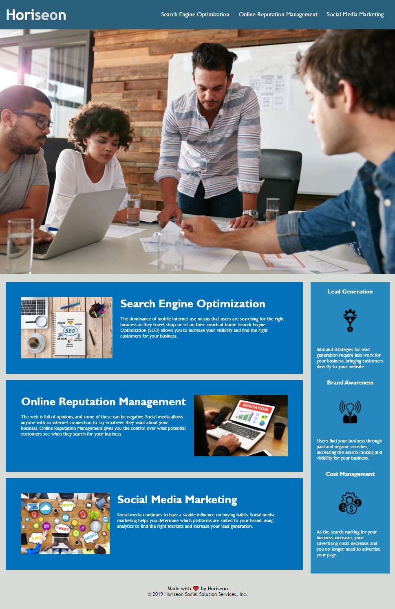

# Refactoring of Horiseon Landing Page
The Horiseon Marketing Agency needed me to refactor their web application to conform to accessibilty standards to ensure their site was optimized for search engines.

I accomplished this by adding semantic elements, a descriptive title, and alt properties for the images.  I also fixed a broken link, consolodated the css file, and added comments to both the html and css files to improve the long-tem sustainabilty of the codebase.

## Website Link
You can checkout the Horiseon landing page [here](https://bthalpin.github.io/Refactor-Horiseon-Landing-Page/).

## Media
The following image displays the appearance of the Horiseon landing page:

